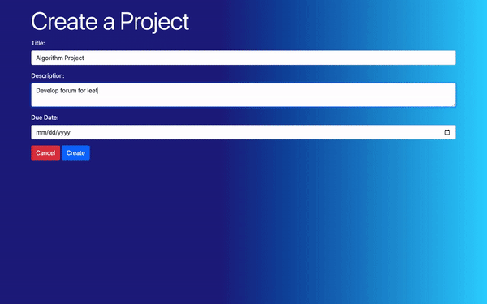

# Project Manager

*Full CRUD management system for tracking progress on projects and associated tasks*

<a href="https://www.youtube.com/watch?v=I7NDLPwjQcY&ab_channel=BrandonTaylor">YouTube Demo</a>

- Built with Java, Spring Boot, MySQL
- Employs many-to-many and multiple one-to-many relationships

## Features

- Ability to create, view, edit, and delete projects
- Users can join or leave project teams. Only projects "joined" will display that project's tasks
- Ability to post new tasks if you are "joined" to a project team
- Project lead may delete or edit project details
- Login, registration, and project validations

## Demo

